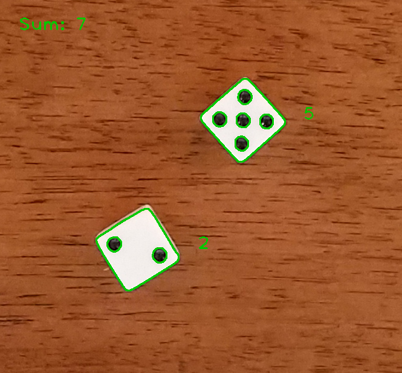

# Count-Dice-Dots

Simple C++ program that counts the number of dots on each dice and returns the sum


### Prerequisites
---
#### cmake
> Build management tool; v2.8 or higher recommended.
> http://www.cmake.org/

#### opencv
> Opensource computer vision library.
> https://opencv.org/

### Build
-----
```sh
$ mkdir build
$ cd build
$ cmake ..
$ make
```

### Run
-----------
```sh
$ ./count_dice_dots input_image output_image
```
Example
```sh
$ ./count_dice_dots ../images/dice1.png ../images/dice1_output.png
```

